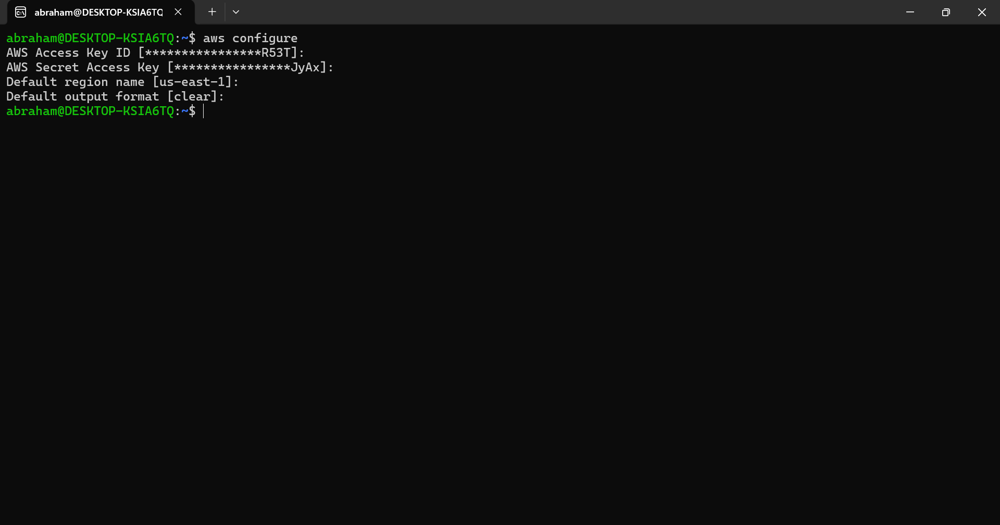
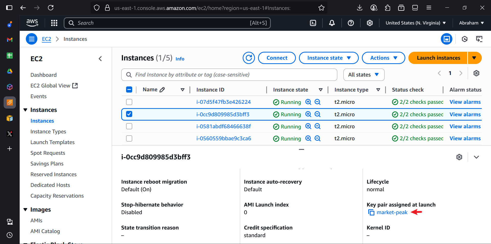
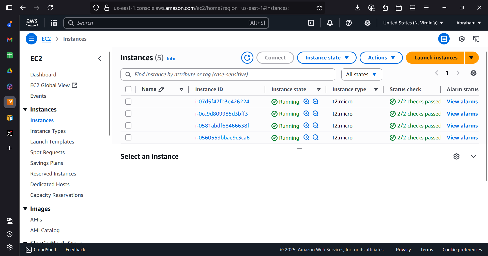

# Mini Project - Creating AWS Resources with Functions & Introducing Arrays

## Project Overview
This mini-project automates AWS EC2 instances and S3 buckets creation using shell scripting functions and arrays for DataWise Solutions, executed on Ubuntu (WSL) with VS Code via Ubuntu, using an Ubuntu-type EC2 instance key pair.

## Setup
- Initiated on Jul 03, 2025, 05:29 AM WAT.
- Used Ubuntu terminal (WSL) with VS Code, documented in /mnt/c/Users/User/Documents/Workspace/Shell_AWS_Mini_Project.

## Execution Steps
1. **Set Up Environment**:
   - Configured AWS CLI with `aws configure` (region `us-east-1`, output `json`).
   - [Screenshot: `aws_config.png` - Shows terminal configuration output (if updated).]
   
2. **Verify Key Pair**:
   - Confirmed the Ubuntu key pair in EC2 Console “Key Pairs” and secured the `.pem` file.
   - [Screenshot: `keypair_verification.png` - Shows "Key Pairs" page with the key pair (if available).]
   
3. **Develop and Fix Script**:
   - Updated `aws_resources.sh` with `create_ec2_instances` (2 Ubuntu instances with AMI `ami-0fb0b230890ccd1e6`)
   - Fixed `InvalidBucketName` with proper naming.
4. **Test the Script**:
   - Ran `./aws_resources.sh testing` successfully after fixes
5. **Verify Resources**:
   - Confirmed 2 EC2 Ubuntu instances in “Instances” (us-east-1) and 5 S3 buckets (e.g., `datawise2025ubuntu-marketing-data-bucket`).
   - [Screenshot: `ec2_instances.png` - Shows "Instances" page.]
   

## Learning Summary
In this mini-project, I enhanced my shell scripting skills by automating AWS resource creation using functions and arrays. I implemented `create_ec2_instances` to provision Ubuntu EC2 instances with a specific key pair and a valid AMI (`ami-0fb0b230890ccd1e6`), ensuring secure access, and `create_s3_buckets` to manage five S3 buckets via an array, showcasing efficient resource handling. I learned to troubleshoot `InvalidAMIID` by selecting an appropriate Ubuntu AMI and resolved `InvalidBucketName` errors by adhering to S3 naming rules, deepening my understanding of AWS CLI integration and error handling with `$?`. This project strengthened my ability to build robust cloud automation solutions tailored to Ubuntu instances.

## Tools Used
- **Ubuntu Terminal (WSL)**: For script execution and testing.
- **VS Code**: For editing `aws_resources.sh` and `README.md`.
- **Git Bash**: For version control and GitHub push.
- **AWS Management Console**: For key pair and resource verification.
- **AWS CLI**: For resource provisioning.

## Project Deliverables
- **Script**: `aws_resources.sh` automates EC2 and S3 creation.
- **Documentation**: This `README.md` with learning summary and screenshot locations.
- **Screenshots**: 
  - `aws_config.png` (if updated)
  - `keypair_verification.png` (if available)
  - `script_output.png`
  - `ec2_instances.png`
  - `s3_buckets.png`
- **Script Link**: [GitHub Repository](https://github.com/westgrin/Shell_AWS_Mini_Project)

## Conclusion
This project successfully automated AWS resource provisioning with functions and arrays, resolved AMI and bucket naming issues, and provided detailed documentation, significantly enhancing my cloud automation expertise with Ubuntu instances.